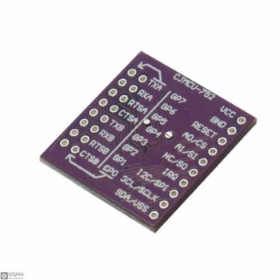

# SC16IS752

[](https://www.arduino.cc/reference/en/libraries/)
[](https://opensource.org/licenses/MIT)

Arduino library for the NXP SC16IS752 dual UART bridge (I2C/SPI).



Microcontrollers have a limited number of UARTs. If you want to attach many Serial devices and Software Serial is too slow you can use some SC16IS752 modules to add 2 additional serial communication ports for each module.


## Features

- Dual UART channels (A/B)
- I2C or SPI transport
- Per-channel `Stream` adapters (`channelA()` / `channelB()`)
- RS485 helpers
- Interrupt helpers
- Optional logger (`SC16IS752Logger`)

## Install

For Arduino, you can download the library as zip and call include Library -> zip library. Or you can git clone this project into the Arduino libraries folder e.g. with

```
cd  ~/Documents/Arduino/libraries
git clone https://github.com/pschatzmann/SC16IS752.git
```

## Wiring Notes

### I2C mode

- Provide `Wire` in the constructor.
- Connect:
  - `VCC` -> 5V (or board-compatible supply)
  - `GND` -> GND
  - `SCL` -> MCU SCL
  - `SDA` -> MCU SDA

### I2C address selection

Typical address mapping from A0/A1 strap:

- A0=HIGH, A1=HIGH -> `0x48`
- A0=HIGH, A1=LOW  -> `0x49`
- A0=LOW,  A1=HIGH -> `0x4C`
- A0=LOW,  A1=LOW  -> `0x4D`

Note: `SC16IS750_ADDRESS_*` constants are 7-bit I2C addresses and are used directly with `Wire`.

### SPI mode

- Provide `SPI` and the cs pin in the constructor.
- Connect:
  - `VCC` -> 5V (or board-compatible supply)
  - `GND` -> GND
  - `A0/CS` -> MCU CS
  - `A1/SI` -> MCU MOSI
  - `NC/SO` -> MCU MISO
  - `SCL/SCLK` -> MCU SCK

## Voltage level note

Many breakout boards provide onboard 3.3V regulation for the SC16IS752 core and are commonly used with 5V-tolerant interfaces, but always verify your exact board schematic before wiring.

## Documentation

- [examples](examples)
- [Class Documentation](https://pschatzmann.github.io/SC16IS752/docs/html/classSC16IS752.html)
